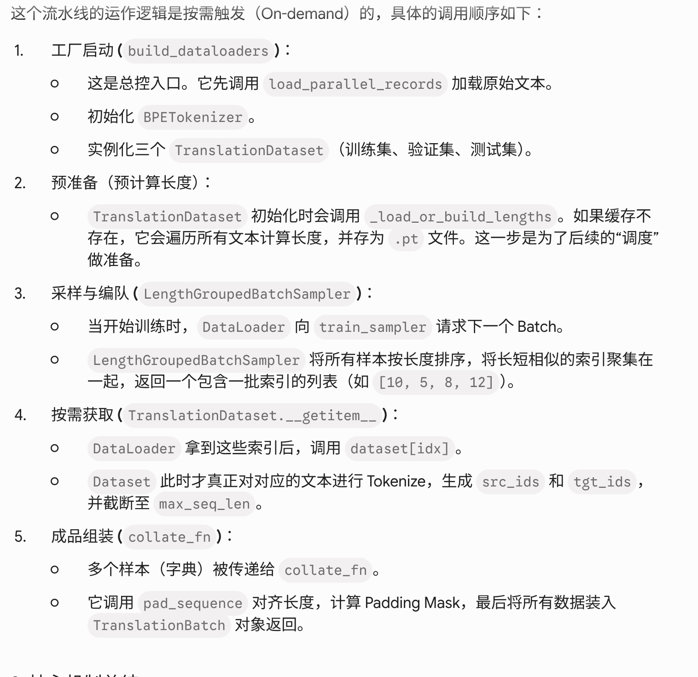

# Note for details

## bpe[Byte Pair Encoding] tokenizer by HF

### 如何获得单字符表作为训练开始？

训练开始前，先扫描整个语料库，收集所有出现过的字符作为初始字符表

语料库（DE+EN 合并）：
  "Hello world"
  "Hallo Welt"
  ...

扫描后初始字符表（举例）：
{ H, e, l, o, w, r, d, a, W, t, ▁, ... } + 特殊 token：< pad>, < unk>, < bos>, < eos>

这就是初始 vocab，每个字符都是一个独立 token，ID 从 0 开始分配。此时 vocab 大小大约是几百（所有 Unicode 字符的实际出现数量）。

### bpe.json的merges如何产生，有什么用？

#### bpe 准备过程

merges 不是"训练完 37K vocab 之后再统计"，merges 本身就是构建 vocab 的过程的产物

每一步做的事：

当前 token 序列（整个语料库展开）：
  ... ▁ w o r l d ...
  ... ▁ w e l t ...
  ... t h e ...

统计所有相邻 token 对的频次：
  (t, h) → 出现 182万次  ← 最高！
  (▁, w) → 出现 95万次
  (i, n) → 出现 88万次
  ...

合并 (t, h) → th：

- 在所有序列中把相邻的 t h 替换成 th
- 把 "th" 加入 vocab
- 把规则 "t h" 记录到 merges 列表

重复以上步骤，每轮产生一条 merge 规则、一个新 token，直到 vocab 从几百扩充到 37000
所以 merges 列表的实质：

merges = [
  "t h",      ← 第1次合并，频次最高
  "▁ th",     ← 第2次合并
  "i n",      ← 第3次合并
  "e r",
  ...
  "un ter",   ← 第36800次合并（已经是较长的子词了）
]

merges 是训练时按频次从高到低依次记录下来的合并操作历史，顺序就是优先级

#### bpe 使用时

metaspace预处理分词 -> word拆分为字符 -> 按merges顺序合并字符为token -> 各token转为vocab中的id

### Metaspace是什么？

Metaspace 做两件事，在 pre_tokenizer 阶段同时完成：切词，加▁

第一件：按空格切词：
"Hello world" → ["Hello", "world"]
切完之后 BPE 在每个 word 内部独立工作，不会跨词合并（这是关键约束，保证词边界）。

第二件：把空格转成 ▁ 挂在词头[配合bpe从sub-word恢复为space分隔的word，否则decode得到subword不知道如何组成word]
["Hello", "world"] → ["Hello", "▁world"]
第一个词不加（或按配置决定），后续每个词头部加 ▁，标记"这是一个词的开始"。
然后每个 word 拆成字符时，▁ 就作为一个普通字符参与 BPE

保留了space在token中的表示，同时提供额外的语义信息，判断词是否在句首

### Normailizer 做了什么？

Normalizer 在分词之前对原始文本做规范化处理，目的是减少训练/推理时的文本多样性噪声
理解为替换部分字符减少同义多符号和音调的差异，语言学？

normalizers = [NFKC()]
if self.lowercase:
    normalizers.append(Lowercase())
tok.normalizer = Sequence(normalizers)

┌────────────┬────────────────────────┬───────────────────────────────────┐
│ 规范化步骤 │          作用          │               例子                │
├────────────┼────────────────────────┼───────────────────────────────────┤
│ NFKC       │ Unicode 兼容等价规范化 │ fi（连字）→ fi；全角 Ａ → A；² → 2 │
├────────────┼────────────────────────┼───────────────────────────────────┤
│ Lowercase  │ 全部转小写             │ Hello → hello                     │
├────────────┼────────────────────────┼───────────────────────────────────┤
│ Sequence   │ 把多个步骤串成流水线   │ 先 NFKC 再小写                    │
└────────────┴────────────────────────┴───────────────────────────────────┘

为什么需要 NFKC：同一个字符在 Unicode 中可能有多种编码形式（比如带音调的字母可以是预合成字符或基础字符+组合符），不做规范化则同义词会被当作不同 token。

### All steps

#### 预处理阶段流程

语料库文本
  ↓ Normalizer（NFKC 规范化，替换部分字符）
规范化文本
  ↓ Metaspace pre_tokenizer（按空格切词，空格→▁）
word 列表：["Hello", "▁world", ...]
  ↓ 每个 word 拆成单字符，视为基础token
字符序列：[H,e,l,l,o], [▁,w,o,r,l,d], ...
  ↓ BPE 迭代：每轮找最高频相邻对，合并，记录 merge 规则
  ↓ 重复到 vocab 达到 37K
产出：vocab（token→ID）+ merges（合并规则列表,频率一定从高到低，因为后来一定不会超越前人频率）
  ↓ 序列化
.bpe.json（含 vocab + merges 两个字段）

关于BPE：**注意！BPE在切词后的slice中统计频率和聚合，而不是在句子中统计/聚合**
这也解释了为什么vocab中没有< bos>,< eos>：因为切词后得到的slice[词]中没有这些token，这些token是句层面的概念

#### encode 流程

新输入文本
  ↓ Normalizer（同训练时）
  ↓ Metaspace pre_tokenizer（同训练时）
word 列表
  ↓ 每个 word 拆成单字符，视为基础token
  ↓ 按 merges 列表顺序依次合并（贪心）
token 序列【一个词可能包含多个token，一个句子从词列表转化为token列表】
  ↓ 查 vocab 映射为 ID
ID 列表
  ↓ encode() 手动插入 < bos>/< eos>在token串前后
最终 ID 序列 → 传入 Transformer

#### decode 流程

ID 列表
  ↓ 查 vocab 反向映射为 token 字符串
token 字符串序列
  ↓ Metaspace decoder（把 ▁ 还原为空格，拼接；这里自然地通过含有▁的token，把subword[token]串还原为有space分隔的word串）
原始文本

### 四种 special token 什么时候使用

---
< unk> — BPE 编码时，遇到未见字符

BPE 从字符开始，理论上能覆盖所有字符。但若使用bpe推理时出现bpe训练语料里从未出现过的字符（某些罕见 Unicode 符号、emoji 等），vocab 里没有对应 ID，就用 < unk> 替代：

训练语料里没出现过 "🐱"
编码 "I love 🐱" → [▁I, ▁love, < unk>]
                                  ↑
                         字符不在 vocab 里

< unk> 在 Tokenizer(models.BPE(unk_token="< unk>")) 这一行注册（第81行），BPE 模型内部遇到陌生字符自动替换，不需要上层代码手动处理。

---
< bos> / < eos> — encode() 调用时，手动插入token串边界，再输入transformer

每次调用 encode() 默认都会加（第107–114行）：

ids.insert(0, self.bos_id)   # 句首
ids.append(self.eos_id)      # 句尾

两者的用途不同：

┌───────┬────────────────────────────────────────────────┬──────────────────────────────────────────┐
│ token │                   训练时作用                   │                推理时作用                │
├───────┼────────────────────────────────────────────────┼──────────────────────────────────────────┤
│ < bos> │ 告诉编码器"序列从这里开始"                     │ 作为解码器的第一个输入，触发生成第一个词 │
├───────┼────────────────────────────────────────────────┼──────────────────────────────────────────┤
│ < eos> │ 作为解码器的预测目标，模型学会在合适位置输出它 │ 模型生成出 < eos> 时，推理循环停止        │
└───────┴────────────────────────────────────────────────┴──────────────────────────────────────────┘

---
< pad> — collate_fn 里，对齐同一 batch 内的序列长度

一个 batch 里各句子处理后的token串长度不同，pad_sequence 把短的补齐到最长那句；例如：

batch 里三句话编码后：
  [2, 312,  44,  3]          长度 4
  [2,   5, 821, 67, 12, 3]   长度 6  ← 最长
  [2,  99,   3]              长度 3

pad 后：
  [2, 312,  44,  3,   0,  0]
  [2,   5, 821, 67,  12,  3]
  [2,  99,   3,  0,   0,  0]
                    ↑
                < pad>=0

src_padding_mask 传给 nn.MultiheadAttention 的 key_padding_mask，让注意力机制忽略 pad 位置，不让它们影响计算结果。

这四个specialtoken在vocab中存储为前4个token
"vocab": {
    "< pad>": 0,
    "< unk>": 1,
    "< bos>": 2,
    "< eos>": 3,
}

### min_freq

min_freq 是 BPE 训练时的最低合并频次阈值,一个 token 对只有在整个语料库中相邻出现次数 ≥ min_freq 时，才会被合并成新 token，进入merges和vocab；这是为了避免低质量token组进入vocab，宁愿少记录也不记录低质量

假设 min_freq = 2：

(x, z) 相邻出现 1 次  → 不合并，不进 vocab
(e, r) 相邻出现 88万次 → 合并成 er，进 vocab  ✓

## dataloader details

parquet 可以视为csv表格的形式，物理上列式存储，带来存储上优点

TranslationDataset是一个字典，key={n_records,max_seq_len,vocab_size},value={lengths}，其中lengths是一个list，存储n_records个数字，描述这n_records个文本句对应的token流长度；TranslationDataset的cache只是token长度的cache，免得每次调用tokenizer.encode计算tokens流长度

records是若干(src_text,tgt_text)对构成的列表
LengthGroupedBatchSampler处理lengths列表的index，返回重排序后的batches，batches由lengths列表的index构成，同一个batches有相似长度
sample是字典,有以下的keys(src_text,tgt_text,src_ids,tgt_ids)和对应的value,ids是tokens序列，是列表

这里没有分开训练en和de的tokenizer，即二者共享一套词表；即使分开训练tokenizer，在训练transformer的encoder时也会把二者的tokens流映射到相同embedding空间

load_parallel_records：根据config解析路径并返回records(src-text,tgt-text)序列
TranslationDataset：负责读取原始记录（records），计算并缓存句子长度，按需进行 Tokenize（将文本转为数字 ID），_getitem_(idx)获取sample
LengthGroupedBatchSampler：在DataLoader中，接受的“长度信息”，给样本打分排序，并将长度相近的样本“编队”（打包成 TranslationBatch）
TranslationBatch：存储最终整理好的数据结构（Tensor 和 Mask），直接送往模型进行训练

DataLoader：PyTorch 原生组件。通过 BatchSampler 选定句子索引并通过Dateset.getitem(idx)得到token串，最后调用 collate_fn 进行最终组装。

## transformer

通过dot-product计算预测的embedding和对应token的embedding的相似度，找最大的token作为输出

## problems

Q0: parquet的train有多个文件
A0: 改path为paths，遍历各path按行读入，用limit约束最多行

Q1: 单独测试各部件，不能保证整体成功
A1: Smoke train，减少训练规模

Q2: 每次bpe需要重建encode的length
A2: 引入lengths的cache

Q3: 语法错误和接口设计
A3: 先写出主干，ai检测

Q3: 拆分transformer时出现跨部件的调用
A3: 提供专门方法实现；进一步地，直接把需要调用的操作封装在部件中(position-embedding、tgt_mask)

Q4: 参数初始化没有明确写出
A4: 使用Xavier/标准正态；embedding使用xavier发现smoke测试时不下降，debug发现瓶颈时pos盖过bpe的内容[0.7：0.4]，根号d-model缩放**ERROR：应该是^-0.5**；修复后成功返回1:1

Q5: bpe重新训练
A5: 存储vocab和merge过程来避免反复训练

Q6: mask具体实现
A6: 填入-inf在attn层中用softmax

Q7: 过拟合[log](log.txt)
A7: 调整初始化，增加layernorm【attn】

考虑减少大量数据的反复cp-paste，resort和sample时通过index操作和getitem
与原实现的区别：原实现的batch是50000个token，其中src和tgt语言各占一半；我的实现是按句子来的
