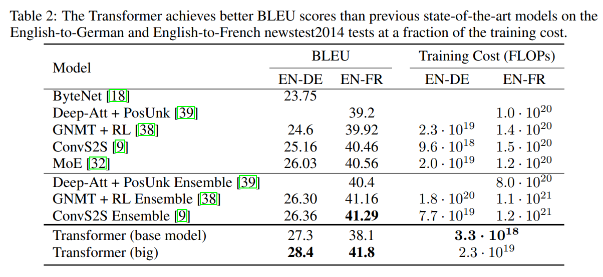
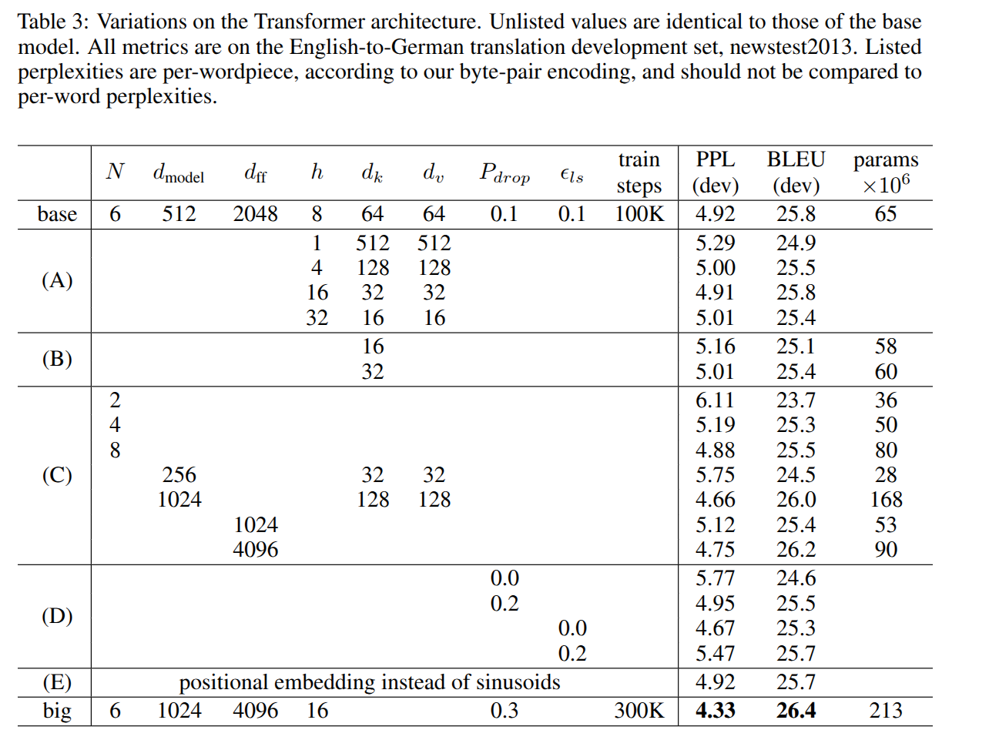

# Dataset uasge

## Train

Sentence pairs were batched together by approximate sequence length. Each training batch contained a set of sentence pairs containing approximately 25000 source tokens and 25000 target tokens

### English 2 German

train on standard WMT 2014 English-German dataset consisting of about 4.5 million sentence pairs Sentences were encoded using byte-pair encoding [3], which has a shared source-target vocabulary of about 37000 tokens

csv format: <https://www.kaggle.com/datasets/mohamedlotfy50/wmt-2014-english-german>
parquet format: <https://huggingface.co/datasets/wmt/wmt14/tree/main/de-en>

### English 2 French

For English-French, we used the significantly larger WMT 2014 English-French dataset consisting of 36M sentences and split tokens into a 32000 word-piece vocabulary [38].

## Evaluation

BLUE on E2G and E2F:

Different config result:

