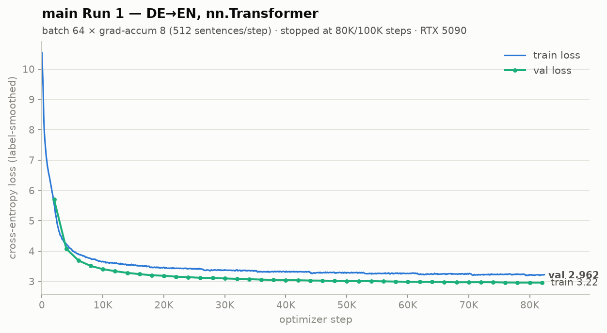
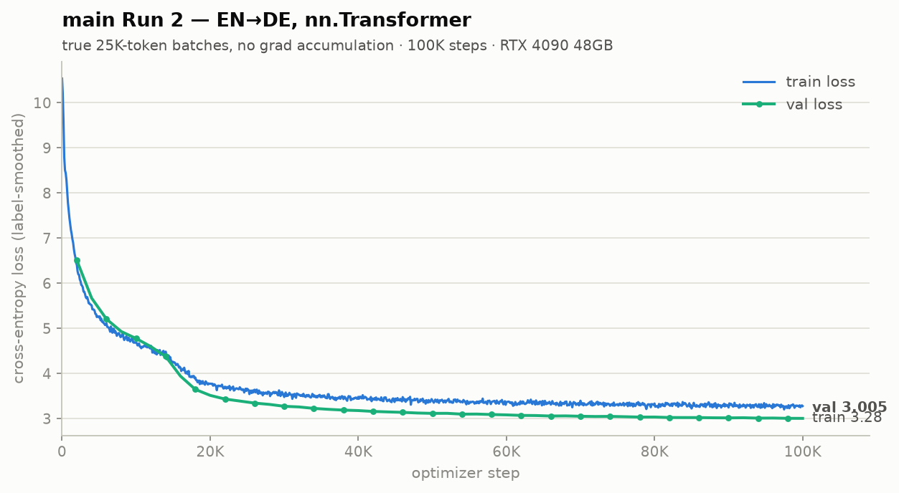
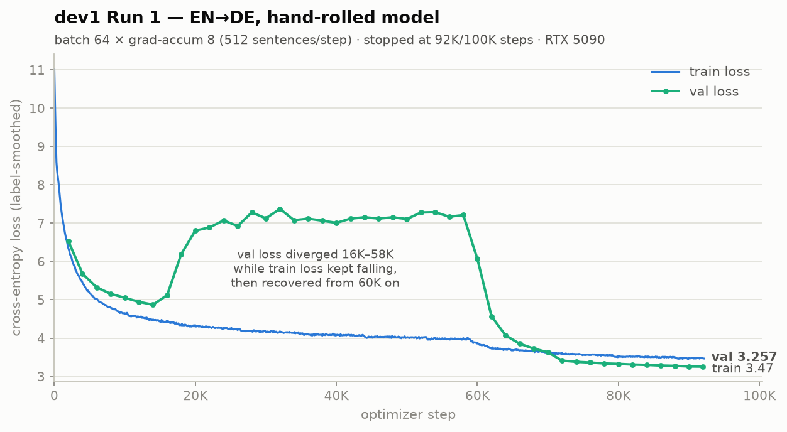
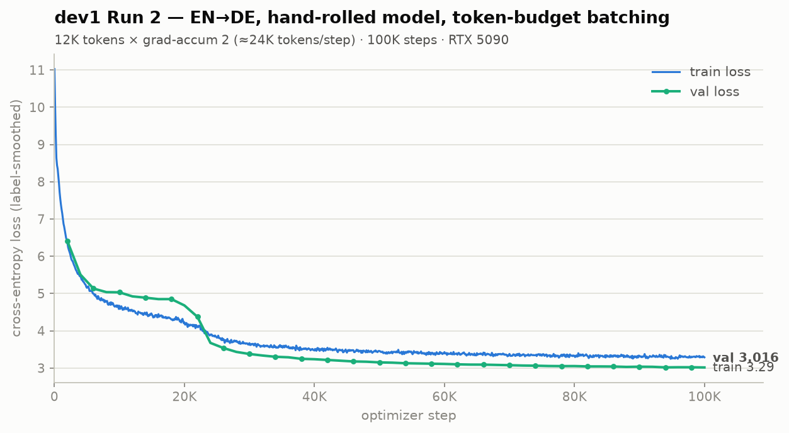
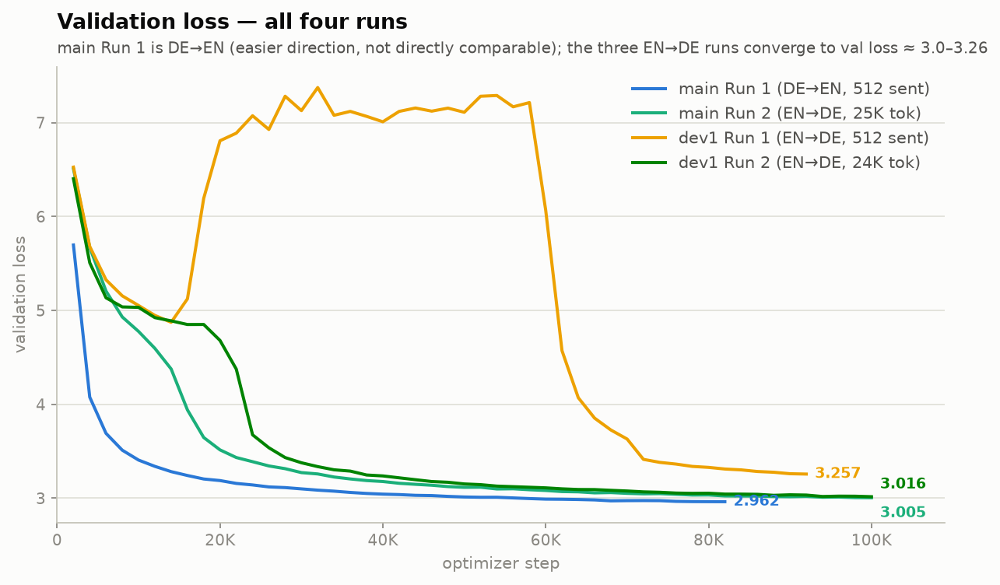

# Recurrence Transformer

Reproduction of the Transformer model from ["Attention Is All You Need"](https://arxiv.org/abs/1706.03762) (Vaswani et al., 2017) for WMT14 machine translation.

Two implementations live in this repo, on separate branches:

- **`main`** — built on PyTorch's `nn.Transformer`. Run 1 trained **DE→EN** (opposite of the paper's direction); Run 2 trained **EN→DE** with true 25K-token batches.
- **`dev1`** (current) — fully hand-rolled encoder/decoder/attention (no `nn.Transformer`), trained **EN→DE**, matching the paper's reported task.

Both share the hand-rolled training infrastructure: BPE tokenizer, NoamOpt scheduler, beam search, and full WMT14 data pipeline.

## Results

### `main` branch — `nn.Transformer`

#### Run 1 — DE→EN (single RTX 5090, ~30 hours, 80K/100K steps)

| Decode | Samples | BLEU | Paper (base, en-de) |
|--------|---------|------|-------------|
| Greedy | 3003 (full test) | 26.93 | — |
| Beam-4 (α=0.6) | 3003 (full test) | **28.19** | — |

BLEU breakdown (beam-4, full): `63.1/36.4/23.0/14.8  BP=0.948`

Note: this result isn't directly comparable to the paper's 27.3 — it's the easier DE→EN direction, not EN→DE.



#### Run 2 — EN→DE, true 25K-token batches (RTX 4090 48GB, 100K/100K steps, no ckpt averaging)

Independent run on a separate machine (AutoDL container, RTX 4090 48 GB, 2026-07-04): same EN→DE task and hyperparameters as the `dev1` runs, but using `nn.Transformer` and a **true 25,000-token batch per step with no gradient accumulation** — the 48 GB card fits the paper's effective batch in a single forward/backward pass. 100K steps, final `val_loss = 3.0047`.

| Checkpoint | Decode | Samples | BLEU | Paper (base, en-de) |
|-----------|--------|---------|------|-------------|
| Single 100K | Beam-4 (α=0.6) | 3003 (full test) | 24.21 | |
| **Avg of last 5 ckpts (§5.3)** | Beam-4 (α=0.6) | 3003 (full test) | **24.59** | **27.3** |

BLEU breakdown (single ckpt): `55.4/29.7/18.1/11.5  BP=1.000 ratio=1.029`
BLEU breakdown (avg ckpt): `55.7/30.1/18.5/11.8  BP=1.000 ratio=1.029`

Checkpoint averaging adds **+0.38** here (24.21 → 24.59), replicating the `dev1` finding (+0.51) on an independent implementation and machine — the technique's contribution is consistent across both codebases.



**This cross-validates both implementations and the batching strategy** against `dev1` Run 2 (hand-rolled modules, 12K tokens × grad_accum 2, 24.26 at 100K steps, val_loss 3.016):
- `nn.Transformer` vs hand-rolled → **24.21 vs 24.26** (Δ0.05, within noise): the hand-rolled encoder/decoder/attention is functionally equivalent to PyTorch's reference implementation.
- True 25K-token single-step batches vs 12K × grad_accum 2 → same result: gradient accumulation is a faithful substitute for large physical batches at this scale.
- The marginally lower val_loss (3.0047 vs 3.016) doesn't translate into a BLEU difference.

The remaining gap to the paper's 27.3 is therefore not an implementation issue — it's dominated by the sacrebleu-vs-tokenized-BLEU metric difference (~0.5–1 point) plus preprocessing-pipeline differences (see the metric note under `dev1` Run 2 below).

### `dev1` branch — EN→DE, hand-rolled model

#### Run 1 — sentence-count batching (single RTX 5090, ~11.5 hours, 92K/100K steps)

Fixed-size batches of 64 sentences × 8 grad-accum (effective batch 512 sentences). Training was interrupted at step 92,100 (val_loss still improving, not fully converged — see below).

| Decode | Samples | BLEU | Paper (base, en-de) |
|--------|---------|------|-------------|
| Beam-4 (α=0.6) | 3003 (full test) | **20.69** | **27.3** |

BLEU breakdown (beam-4, full): `52.9/26.3/14.9/8.8  BP=1.000 ratio=1.019`

Val loss trajectory (last 20K steps, still trending down when stopped):
`74K: 3.38 → 78K: 3.34 → 82K: 3.31 → 86K: 3.28 → 90K: 3.26 → 92K: 3.257`



The loss curves reveal an anomaly the summary numbers hide: **val loss diverged from ~16K to 58K steps** (climbing from 4.87 to a plateau around 7.0–7.37) while train loss kept falling normally, then abruptly recovered from step 60K onward. Roughly 40K of the 92K steps were spent in this diverged regime, which — on top of the early stop — helps explain the low 20.69 BLEU relative to Run 2's 24.26.

#### Run 2 — token-budget batching, paper-scale batches (single RTX 5090, ~9.7 hours, 100K/100K steps) ⭐ current

Retrained from scratch (2026-07-03 → 07-04) after switching the dataloader to **token-budget batching**: `max_tokens_per_batch=12000 × grad_accum=2 = 24K tokens/step`, matching the paper's ~25K-token effective batch. Final `val_loss = 3.016`.

| Decode | Samples | BLEU | Paper (base, en-de) |
|--------|---------|------|-------------|
| Beam-4 (α=0.6) | 3003 (full test) | **24.26** | **27.3** |

BLEU breakdown (beam-4, full): `55.9/29.8/18.0/11.5  BP=1.000 ratio=1.016`

**Run 2 vs Run 1: +3.57 BLEU (20.69 → 24.26), val_loss 3.257 → 3.016, and ~2 hours *less* wall-clock time.** The only substantive change is the batching strategy: length-bucketed token-budget batches waste far fewer pad tokens per step and deliver the paper's effective batch size, so each step is both cheaper and more informative. This closes most of the gap to the paper's 27.3; the remainder is consistent with the paper's use of checkpoint averaging and a multi-GPU setup.



#### Run 2 (continued) — +20K steps & checkpoint averaging (paper §5.3) ⭐ best

Resumed Run 2 from 100K to **120K steps** (2026-07-04), saving a snapshot every 1,000 steps. Following the paper's evaluation recipe — *"a single model obtained by averaging the last 5 checkpoints"* — the snapshots from steps 116K–120K were averaged into `artifacts/pytorch_transformer_avg.pt` and evaluated with beam-4:

| Checkpoint | Decode | Samples | BLEU | Paper (base, en-de) |
|-----------|--------|---------|------|-------------|
| Single 100K | Beam-4 (α=0.6) | 3003 (full test) | 24.26 | |
| Single 120K | Beam-4 (α=0.6) | 3003 (full test) | 24.28 | |
| **Avg of last 5 (116K–120K)** | Beam-4 (α=0.6) | 3003 (full test) | **24.79** | **27.3** |

BLEU breakdown (avg ckpt, beam-4, full): `56.1/30.3/18.6/11.9  BP=1.000 ratio=1.023`

**The +0.5 BLEU comes almost entirely from checkpoint averaging, not the extra training.** The single-checkpoint ablation isolates the two effects: 20K extra steps moved BLEU by only +0.02 (24.26 → 24.28 — training has plateaued), while averaging the last 5 snapshots added **+0.51** over the single 120K checkpoint (24.28 → 24.79), squarely in the +0.3–0.5 range typically attributed to this technique. All four n-gram precisions improve.

Metric note: sacrebleu (detokenized 13a) reads below the paper's tokenized BLEU + compound splitting. Re-scoring these same predictions with an approximation of the paper's recipe (13a tokenization + `##AT##` compound splitting) gives **25.23** (25.47 with intl tokenization), so 24.79 corresponds to roughly ~25.5–26 in the paper's metric — the true quality gap to 27.3 is ~1.3–1.8 BLEU, not ~2.5.

### Loss curves — all four runs



The three EN→DE runs converge to val loss ≈ 3.0–3.26 regardless of implementation (`nn.Transformer` vs hand-rolled) and batching strategy, while DE→EN (main Run 1) sits slightly lower (2.96) — consistent with it being the easier direction. dev1 Run 1's mid-run val-loss divergence (16K–58K) is clearly visible; both Run 2s show none of it.

## Project Structure

```shell
Transformer_handmade/
├── config.py              # All hyperparameters (dataclass)
├── train.py               # Training loop + NoamOpt scheduler
├── inference.py           # Interactive translation (greedy / beam search)
├── test.py                # Unit tests + BLEU evaluation
├── scripts/
│   ├── train.sh           # Launch training with logging
│   ├── eval.sh            # Full test-set BLEU evaluation
│   └── translate.sh       # Translate a single sentence
├── model/
│   ├── transformer.py     # Seq2SeqTransformer, PositionalEncoding, beam search
│   ├── attention.py
│   ├── encoder.py
│   ├── decoder.py
│   └── layers.py
├── data/
│   ├── my_tokenizer.py    # ByteLevel BPE tokenizer (HuggingFace tokenizers)
│   ├── my_dataloader.py   # Dataset + DataLoader + batch collation
│   └── en-de-csv/         # WMT14 DE-EN CSV (~4.5M pairs)
└── artifacts/             # Checkpoints + tokenizers (gitignored)
    ├── pytorch_transformer.pt
    ├── tokenizer.json
    └── logs/
```

## Quick Start

### Requirements

```bash
conda create -n transformer python=3.11
conda activate transformer
pip install torch pandas sacrebleu tokenizers
```

### Training

```bash
bash Transformer_handmade/scripts/train.sh
```

Logs are saved to `Transformer_handmade/artifacts/logs/train_YYYYMMDD_HHMMSS.log`.

To monitor live:
```bash
tail -f Transformer_handmade/artifacts/logs/train_*.log
```

Training produces:
- `artifacts/pytorch_transformer.pt` — model checkpoint
- `artifacts/tokenizer.json` — shared BPE tokenizer (37K vocab)

### BLEU Evaluation

```bash
# Full test set, beam-4 (paper setting) — ~30 min on RTX 5090
bash Transformer_handmade/scripts/eval.sh

# Save predictions as TSV (SRC / HYP / REF columns)
bash Transformer_handmade/scripts/eval.sh --output predictions.tsv

# Quick sanity check (256 samples)
bash Transformer_handmade/scripts/eval.sh --max-bleu-samples 256

# Greedy decoding (fast)
bash Transformer_handmade/scripts/eval.sh --beam 1
```

Or run directly via Python for more options:
```bash
python -m Transformer_handmade.test --skip-unit --beam 4 --max-bleu-samples 0 --output predictions.tsv
```

#### Checkpoint averaging (paper §5.3)

Train with `--checkpoint-avg-every 1000` to write snapshots into `artifacts/avg_ckpts/`, then evaluate the average of the last 5 snapshots (rebuilt automatically if stale):

```bash
python -m Transformer_handmade.test --skip-unit --avg --max-bleu-samples 0 --output avg_predictions.tsv

# Average a different number of snapshots (paper uses 20 for the big model)
python -m Transformer_handmade.test --skip-unit --avg --avg-n 20

# Or build the averaged checkpoint manually
python -m Transformer_handmade.average_checkpoints --n 5
```

### Inference

```bash
# Greedy decoding (~instant)
bash Transformer_handmade/scripts/translate.sh "The cat sits on the mat."

# Beam search (beam=4, α=0.6)
bash Transformer_handmade/scripts/translate.sh --beam "The cat sits on the mat."
```

Or from Python:
```python
from Transformer_handmade.inference import translate

print(translate("Good morning, how are you?"))           # greedy
print(translate("Good morning, how are you?", use_beam=True))  # beam-4
```

Input language is **English (EN)**, output is **German (DE)** (on `dev1`; `main` is reversed — DE→EN).

### Unit Tests

```bash
python -m Transformer_handmade.test --skip-bleu
```

## Model Configuration

All hyperparameters in `Transformer_handmade/config.py`:

| Parameter | Value | Paper |
|-----------|-------|-------|
| **Architecture** | | |
| Layers (N) | 6 | ✓ |
| Heads (h) | 8 | ✓ |
| d_model | 512 | ✓ |
| d_ff | 2048 | ✓ |
| Dropout | 0.1 | ✓ |
| **Optimization** | | |
| Steps | 100,000 | ✓ |
| Warmup steps | 4,000 | ✓ |
| LR schedule | NoamOpt | ✓ |
| Adam β₁, β₂, ε | 0.9, 0.98, 1e-9 | ✓ |
| Label smoothing | 0.1 | ✓ |
| **Data** | | |
| Dataset | WMT14 EN-DE, `dev1`; DE-EN, `main` (~4.5M pairs) | ✓ |
| Tokenizer | ByteLevel BPE, 37K vocab | ✓ |
| Shared embeddings | src = tgt = output projection | ✓ |
| **Inference** | | |
| Beam size | 4 | ✓ |
| Length penalty α | 0.6 | ✓ |

### Single-GPU Adaptations

The paper used 8×P100 GPUs with an effective batch of ~25K tokens. Adaptations for a single GPU:

| Setting | This repo | Paper |
|---------|-----------|-------|
| Effective batch | 512 sentences (run 1) → **24K tokens** (12K×2 accum, run 2) | ~25K tokens |
| Precision | bfloat16 AMP | fp32 |
| Hardware | 1×RTX 5090 (24 GB) | 8×P100 (16 GB each) |
| Steps trained | 80K (`main`) / 100K (`dev1` run 2) | 100K |

## Memory Requirements

| batch_size | GPU Memory | Notes |
|------------|-----------|-------|
| 128 | ~24 GB | OOM on 24 GB GPU |
| 64 | ~13 GB | Default (safe) |
| 32 | ~8 GB | Comfortable |
| 16 | ~5 GB | Small GPU |

Use `grad_accum_steps` to maintain effective batch size with less memory:
```python
batch_size = 32
grad_accum_steps = 4   # effective batch = 128
```

## Decode Methods

| Method | Speed | BLEU (`main`, de-en) | BLEU (`dev1`, en-de) | Notes |
|--------|-------|------|------|-------|
| Greedy | ~7 sent/s | 26.93 | — | Best token at each step |
| Beam-4 | ~1.4–1.6 sent/s | 28.19 | 24.26 | Paper setting; keeps 4 candidates |
| Beam-4 + avg ckpt | ~1.4–1.6 sent/s | — | **24.79** | Paper §5.3: average of last 5 checkpoints (116K–120K) |

`main` Run 2 (EN→DE, `nn.Transformer`, true 25K-token batches) scored **24.21** beam-4 single-ckpt / **24.59** with checkpoint averaging — see Results above.

Beam search applies a **length penalty** to prevent bias toward short sequences:

$$\text{score}(Y) = \frac{\log P(Y|X)}{((5 + |Y|) / 6)^{\alpha}}, \quad \alpha = 0.6$$

## Key Design Decisions

**NoamOpt Scheduler.** `lr = d_model^(-0.5) × min(step^(-0.5), step × warmup^(-1.5))`. Warmup is critical for stability — without it, gradients explode in early steps.

**Shared Embeddings.** Source embedding, target embedding, and output projection share the same weight matrix. Reduces parameters by ~38M and acts as a regularizer (paper Table 3, row E).

**Batched Beam Search.** All active beams are processed in a single batched decoder call per step, giving a `beam_size×` speedup over the naive sequential implementation. No KV caching — decoding is still O(T²) per sentence.

**bfloat16 AMP.** RTX 5090 supports bfloat16 natively; no `GradScaler` needed. Combined with TF32 matmul (`torch.set_float32_matmul_precision("high")`), training throughput improves ~1.5× over fp32.

## References

- [Attention Is All You Need](https://arxiv.org/abs/1706.03762) — Vaswani et al., NeurIPS 2017
- [WMT14 Translation Task](https://www.statmt.org/wmt14/translation-task.html)
- [sacrebleu](https://github.com/mjpost/sacrebleu) — standard BLEU evaluation
- [HuggingFace Tokenizers](https://github.com/huggingface/tokenizers) — BPE implementation
